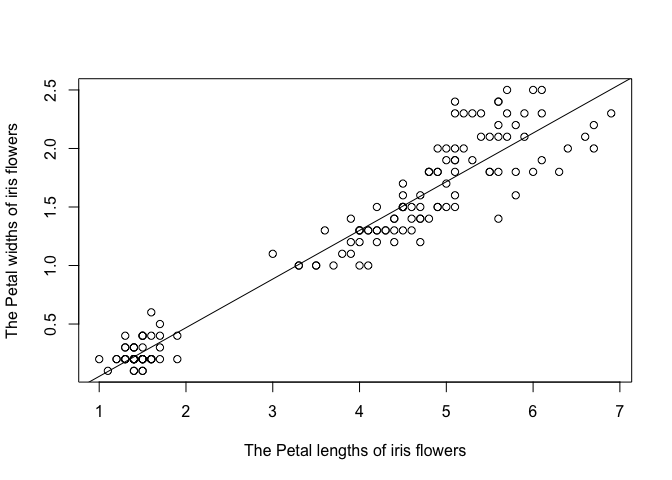

<!-- README.md is generated from README.Rmd. Please edit that file -->

# slrmodel

<!-- badges: start -->

[](https://github.com/lyvqian/slrmodel/actions/workflows/R-CMD-check.yaml)
[](https://app.codecov.io/gh/lyvqian/slrmodel?branch=main)
<!-- badges: end -->

## Overview

The simple linear regression model $y={\beta_0}+{\beta_1}x+{\epsilon}$
is a model that summarizes the relationship between an independent
variable `x` (predictor) a dependent variable `y` (response).
${\beta_0}$ and ${\beta_1}$ are usually unknown and need to be estimated
using observed data (x<sub>1</sub>,y<sub>1</sub>),
(x<sub>2</sub>,y<sub>2</sub>),…, (x<sub>n</sub>,y<sub>n</sub>), and
${\epsilon}$ is a random error term. Deriving the estimators
${\hat{\beta_0}}$ and ${\hat{\beta_1}}$ by the method of least squares
would help to obtain the best-fitting line
${\hat{y}}={\hat{\beta_0}}+{\hat{\beta_1}}x$, that is, the straight line
demonstrating the best approximation of the given set of data.

The goal of slrmodel is to calculate the ${\hat{\beta_0}}$ and
${\hat{\beta_1}}$ using the method of least squares, test the
significance of (x,y) association, and evaluate the overall fitness of
the ${\hat{y}}={\hat{\beta_0}}+{\hat{\beta_1}}x$ model.

- `slr_beta()` creates a matrix of coefficients of the simple linear
  regression model.
- `slr_rsquared()` calculates the coefficient of determination
  R<sup>2</sup>.

## Installation

You can install the development version of slrmodel from
[GitHub](https://github.com/) with:

``` r
# install.packages("devtools")
devtools::install_github("lyvqian/slrmodel")
```

## Example

This is a basic example which shows you how to solve a common problem:

``` r
library(slrmodel)
```

What is special about using `README.Rmd` instead of just `README.md`?
You can include R chunks like so:

``` r
summary(iris)
#>   Sepal.Length    Sepal.Width     Petal.Length    Petal.Width   
#>  Min.   :4.300   Min.   :2.000   Min.   :1.000   Min.   :0.100  
#>  1st Qu.:5.100   1st Qu.:2.800   1st Qu.:1.600   1st Qu.:0.300  
#>  Median :5.800   Median :3.000   Median :4.350   Median :1.300  
#>  Mean   :5.843   Mean   :3.057   Mean   :3.758   Mean   :1.199  
#>  3rd Qu.:6.400   3rd Qu.:3.300   3rd Qu.:5.100   3rd Qu.:1.800  
#>  Max.   :7.900   Max.   :4.400   Max.   :6.900   Max.   :2.500  
#>        Species  
#>  setosa    :50  
#>  versicolor:50  
#>  virginica :50  
#>                 
#>                 
#> 
```

You’ll still need to render `README.Rmd` regularly, to keep `README.md`
up-to-date. `devtools::build_readme()` is handy for this. You could also
use GitHub Actions to re-render `README.Rmd` every time you push. An
example workflow can be found here:
<https://github.com/r-lib/actions/tree/v1/examples>.

You can also embed plots, for example:



In that case, don’t forget to commit and push the resulting figure
files, so they display on GitHub and CRAN.
